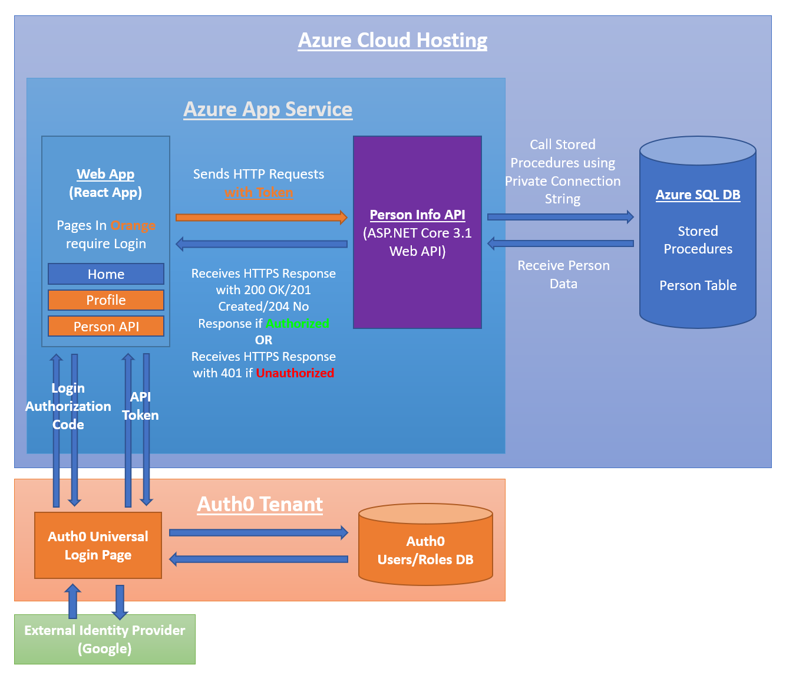

# PersonInfoAPI
#### This repo contains my final project from my internship at <a href="https://naba4u.org/">The New American Business Association</a>.

The website is hosted at this url:
https://drewapiwebapp.azurewebsites.net/

The Person API is accessed from the **Person API** link at the top of the page.

## Description
**The technologies used include:**
* C# (Main programming language)
* JavaScript (Website scripting)
* SQL (Relational Database)
* React v16.13 (For front end webpage design)
* React Bootstrap (For components with Bootstrap CSS and JS)
* ASP.NET Core 3.1 (To build the Web API)
* xUnit (For Unit Testing of the Web API)
* JSON Web Token Bearer Authentication (JWT)
* RSA signature with SHA-256 Encryption (RS256)
* Auth0 Universal Login (Route-based security)
* Auth0 API Service (To prevent the API from being used without a token retrieved from logging into the site.)
* Azure Cloud (To Publicly Host the Web Application (Front End & Web API) and SQL Database)
* Azure DevOps (Build and Release Pipeline (CI/CD))

## Project Architecture

## React v16.13 Web App
* Utilizes functional components with hooks to manage the state of the application.
* Utilizes react-bootstrap to style the page and provide functionality.
* Utilizes Auth0 Universal Login to protect specific routes and components that require a login for access.
* Utilizes tokens requested from the Auth0 Identity provider to securely access the Web API hosted on Azure Cloud.

## Web API
* Created using ASP.NET Core v3.1
* Features the ability to Create, Read, Update, and Delete a Person. (CRUD)
* Features HTTP method endpoints using GET, POST, PUT, and DELETE.
* Features HTTPS endpoint routing with Auth0 Authorization Middleware.
* Features a CORS policy to prevent access except from specific origins, headers, methods, and with specific credentials.
* Tested using Postman.

## Azure SQL Database
* Hosted on Azure Cloud and has the following contents:

### Azure SQL Database Contents

#### Stored Procedures for:
* SELECT (All Rows),
* SELECT (By Id),
* INSERT (Single Row),
* UPDATE (By Id), and
* DELETE (By Id) operations on the Person Table.

#### Person Table

Id  | First  Name | Last Name
--- | ----------- | ---------
1   | John        | Smith
2   | Jane        | Doe
... | ...         | ...

## Azure DevOps Pipeline (CI/CD)
* Features Automatic Package Restoration, Token Replacement, Project Build, Test, and Deployment steps to a separate Development and Production environment.
* Features Automatic execution of Unit Tests created using xUnit.
* Features token string replacement using build variables to protect sensitive information from being known. (DB Connection String with DB Username and Password, Auth0 Domain, Auth0 Audience)

## Unit Testing (xUnit)
* Features 14 Unit Tests executed against the PersonController.cs class to verify correct functionality with a Mock Repository.

## Security (Auth0)
* Utilizes Auth0 Universal Login.
* Utilizes Auth0 SPA to secure the React App.
* Utilizes Auth0 API to secure the Web API.

